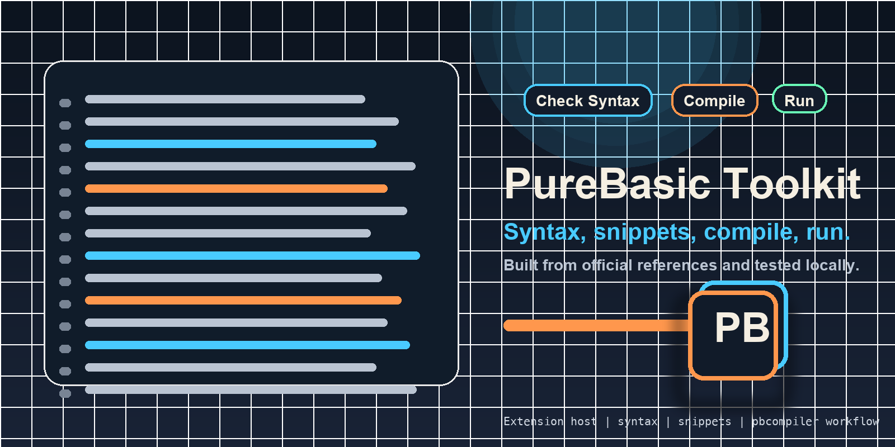
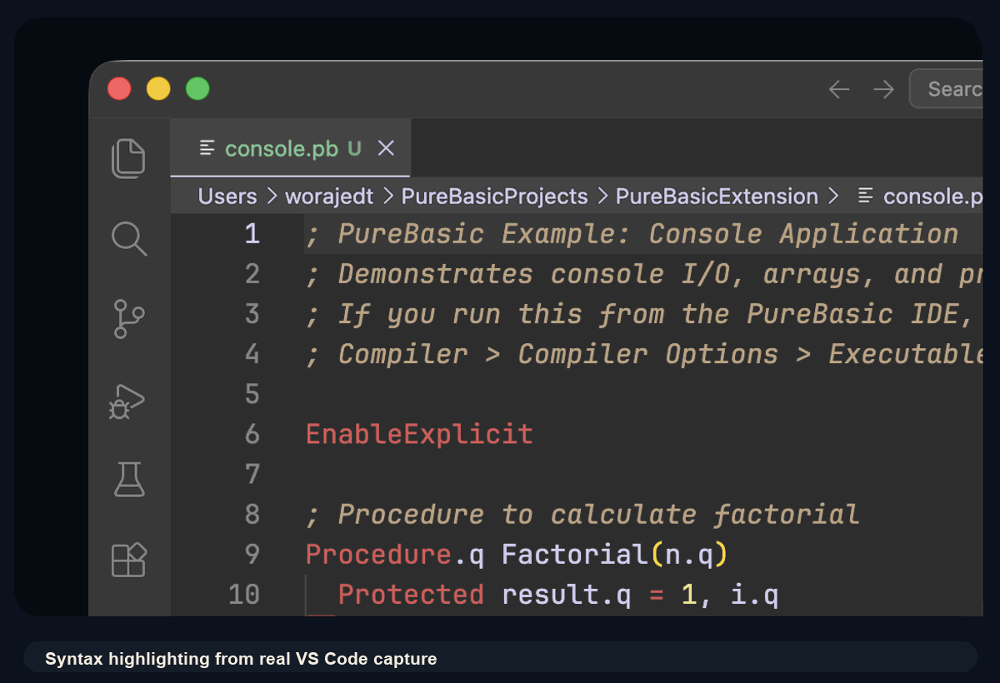
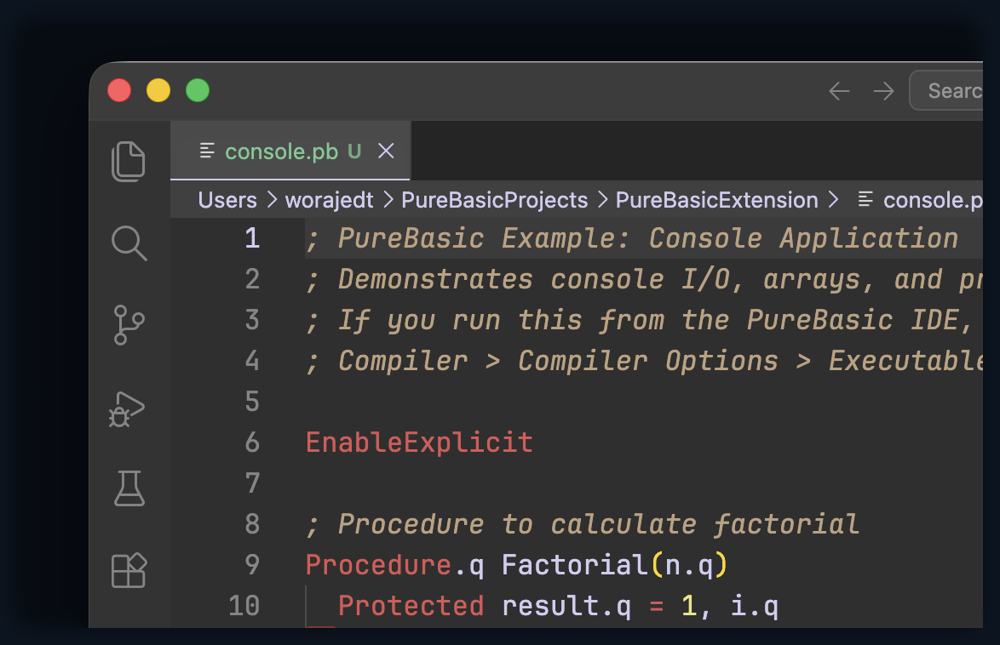
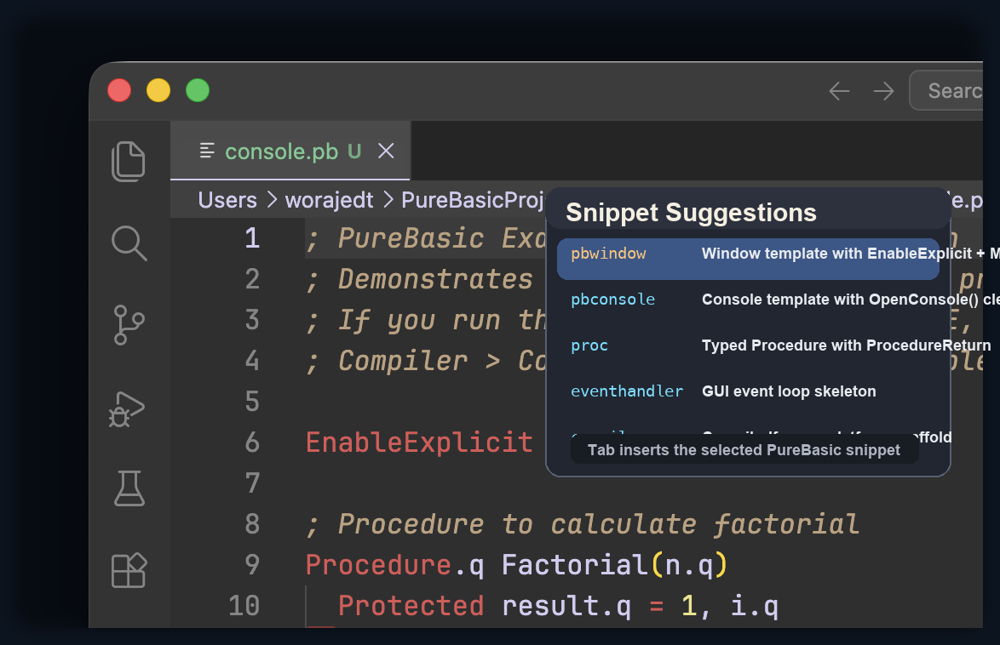
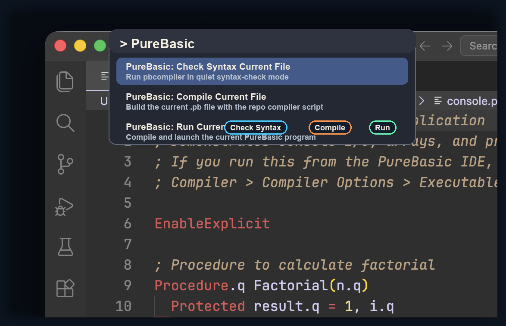

# PureBasic Toolkit



PureBasic editor support for VS Code, developed from a clean-start scaffold in this repository and grounded in the official PureBasic help and example corpus.

## What Ships in 0.8.0

- PureBasic file recognition for `.pb`, `.pbi`, and `.pbp`
- donor-based syntax highlighting tuned against real PureBasic sources
- curated snippets and starter templates for console and window applications
- hover docs for recognized PureBasic commands and topics
- lightweight PureBasic-aware diagnostics for common setup and style gotchas
- Outline/document symbols for core PureBasic code structures
- lightweight Go to Definition support for local procedures, modules, and include-linked files
- project-aware diagnostics for missing include files, unresolved `UseModule`, and unresolved `Module::Symbol` lookups
- symbol-aware diagnostics for unresolved local procedure calls, including typo suggestions for likely built-in commands
- workspace symbol search for procedures, modules, declarations, structures, macros, and interfaces
- broader workspace-aware Go to Definition fallback when local/include-linked lookup is not enough
- `PureBasic: Open Documentation for Symbol`
- `PureBasic: Check Syntax Current File`
- `PureBasic: Compile Current File`
- `PureBasic: Run Current File`
- repo-owned scripts for reliable local PureBasic compile and run workflows
- packaged offline PureBasic help pages for local documentation lookup

## Preview



### Screenshots







## Quick Start

1. Install the packaged `.vsix` or run the extension in an Extension Development Host.
2. Open a `.pb`, `.pbi`, or `.pbp` file.
3. Use the Command Palette and run:
   - `PureBasic: Open Documentation for Symbol`
   - `PureBasic: Check Syntax Current File`
   - `PureBasic: Compile Current File`
   - `PureBasic: Run Current File`

## Current Status

The project now has a working Phase 8 baseline.

This repo already contains:

- official PureBasic help and example references
- generated and normalized PureBasic source corpora for validation work
- local utility scripts for PureBasic compile and run workflows
- a phased product plan in `development_plan.md`
- baseline GitHub Actions workflows for CI and tagged releases
- donor-based syntax highlighting and a stronger snippet pack for PureBasic editing
- offline docs and lightweight diagnostics grounded in the local PureBasic corpus
- lightweight navigation support for local code structure and definitions
- project-aware diagnostics that check include and module wiring instead of only single-file style rules
- symbol-aware warnings that catch likely invented APIs and misspelled built-in calls
- workspace symbol search and broader workspace fallback for navigation

The extension product path is now being built at the repo root.

## Important Note for Book Examples

Most examples in this book are console applications.

If you run them from the PureBasic IDE, you must go to:

- `Compiler` menu
- `Compiler Options`
- first tab: `Executable Format`
- set it to `Console`

If that setting is left as a GUI executable, console examples can fail with messages such as "No console is currently opened", even when the code itself is correct.

## Command Support

The extension currently runs build actions through the repo scripts:

- `scripts/pbc.sh`
- `scripts/run.sh`

That means Phase 2 commands work best when the current file lives inside this repository or another workspace that provides the same scripts.

Current command behavior:

- `Open Documentation for Symbol` opens the packaged local PureBasic help page for the symbol under the cursor
- `Check Syntax` works on `.pb` and `.pbi`
- `Compile` currently requires an active `.pb` file
- `Run` currently requires an active `.pb` file
- build and run requests are intentionally serialized so `pbcompiler` does not collide with another in-flight task

Current docs behavior:

- hover docs appear for recognized PureBasic commands, keywords, and indexed help topics
- full local docs open from the command palette or from hover links
- docs are served from the packaged `purebasic_help` corpus, so they work offline

Current diagnostics behavior:

- warns when `EnableExplicit` is missing
- hints when console APIs are detected, including the IDE path to `Executable Format = Console`
- suggests `XIncludeFile` when shared `.pbi` includes still use `IncludeFile`
- warns when `IncludeFile` or `XIncludeFile` points at a missing file
- warns when `UseModule` targets cannot be found
- warns when `Module::Symbol` lookups cannot be resolved locally
- warns when unqualified procedure calls cannot be resolved locally and suggests likely PureBasic built-ins when it has a close match
- can be tuned through `purebasic.diagnostics.*` settings

Current navigation behavior:

- Outline shows procedures, modules, declare modules, structures, enumerations, interfaces, and macros
- Go to Definition resolves local procedures and modules in the active file
- local include files referenced by `XIncludeFile` and `IncludeFile` are searched before wider workspace fallback
- workspace symbol search surfaces matching PureBasic declarations across the current workspace
- when local/include-linked lookup misses, Go to Definition falls back to a wider workspace scan
- the navigation layer is intentionally lightweight and local-first, not a full LSP parser

## Planned Next Layers

- deeper cross-file/project awareness when real PureBasic projects demand it
- safer scope/type diagnostics built on the current lightweight parser
- evaluate whether richer language features justify a future LSP layer
- packaging, CI, tags, and GitHub Releases

## Development Workflow

Use short, focused cycles:

1. create a branch from `main`
2. implement one phase or sub-phase
3. build and test locally
4. update Markdown docs
5. open a PR
6. merge cleanly
7. tag and release when that cycle is meant to ship

Recommended branch naming:

- `codex/phase-0-scaffold`
- `codex/phase-1-grammar-snippets`
- `codex/phase-2-build-run`

## Local Development

Install dependencies:

```bash
npm install
```

Build the extension:

```bash
npm run build
```

Create a `.vsix` package:

```bash
npm run package:vsix
```

Current packaged artifact:

- `purebasic-toolkit-0.8.0.vsix`

Current release prep notes:

- `docs/releases/v0.8.0.md`

## GitHub Release Flow

Recommended release flow:

1. merge the release PR into `main`
2. open GitHub Actions
3. run the `Release` workflow manually on `main`
4. enter the version, for example `0.8.0`

What the manual release workflow does:

- verifies the requested version matches `package.json`
- verifies `CHANGELOG.md` contains that version
- builds the extension and packages the `.vsix`
- creates and pushes the tag
- publishes the GitHub Release with notes derived from `CHANGELOG.md`

## Source Material

The extension should use these local sources as authorities:

- `purebasic_help`
- `reference_sources`
- `reference_3d_game_engine`

Older local extension experiments are useful as donor material, but not as the new foundation:

- `/Users/worajedt/PureBasicProjects/pure_extensions/purebasic-x10`
- `/Users/worajedt/PureBasicProjects/pure_extensions/purebasic-lsp`
- `/Users/worajedt/PureBasicProjects/pure_extensions/purebasic-mcp-server`
